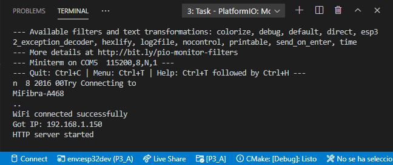
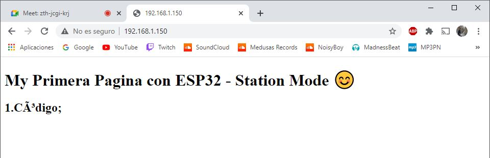
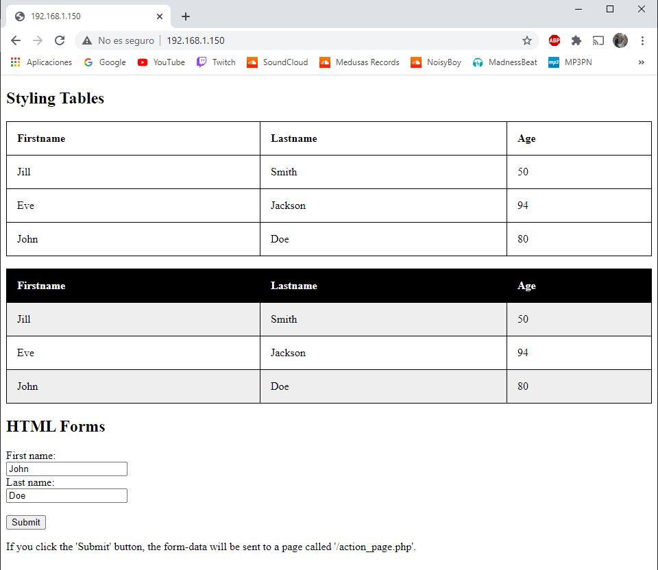

# PRÁCTICA 3A  :  Generación De Una Pagina Web

## 1.Código

'#'include <'WiFi.h'>
'#'include <'WebServer.h'>
// SSID & Password
const char* ssid = "********"; // Enter your SSID here
const char* password = "*******"; //Enter your Password here
WebServer server(80); // Object of WebServer(HTTP port, 80 is defult)

void handle_root(void);

void setup() {

  Serial.begin(115200);
  Serial.println("Try Connecting to ");
  Serial.println(ssid);
  // Connect to your wi-fi modem
  WiFi.begin(ssid, password);
  // Check wi-fi is connected to wi-fi network
  while (WiFi.status() != WL_CONNECTED) {

    delay(1000);
    Serial.print(".");

  }

  Serial.println("");
  Serial.println("WiFi connected successfully");
  Serial.print("Got IP: ");
  Serial.println(WiFi.localIP()); //Show ESP32 IP on serial
  server.on("/", handle_root);
  server.begin();
  Serial.println("HTTP server started");
  delay(100);

}

void loop() {

  server.handleClient();

}

// HTML & CSS contents which display on web server
<> String HTML = "<!'DOCTYPE html'>\
<'html'>\
<'head'>\
<'style'>\
\
table {\
  width:100%;\
}\
\
table, th, td {\
  border: 1px solid black;\
  border-collapse: collapse;\
}\
\
th, td {\
  padding: 15px;\
  text-align: left;\
}\
\
t01 tr:nth-child(even) {\
  background-color: #eee;\
}\
\
t01 tr:nth-child(odd) {\
 background-color: #fff;\
}\
\
t01 th {\
  background-color: black;\
  color: white;\
}\
\
</'style'>\
</'head'>\
<'body'>\
<'h2'>Styling Tables</'h2'>\
<'table'>\
  <'tr'>\
    <'th'>Firstname</'th'>\
    <'th'>Lastname</'th'>\
    <'th'>Age</'th'>\
  </'tr'>\
  <'tr'>\
    <'td'>Jill</'td'>\
    <'td'>Smith</'td'>\
    <'td'>50</'td'>\
  </'tr'>\
  <'tr'>\
    <'td'>Eve</'td'>\
    <'td'>Jackson</'td'>\
    <'td'>94</'td'>\
  </'tr'>\
  <'tr'>\
    <'td'>John</'td'>\
    <'td'>Doe</'td'>\
    <'td'>80</'td'>\
  </'tr'>\
</'table'>\
<'br'>\
<'table id='t01'>\
  <'tr'>\
    <'th'>Firstname</'th'>\
    <'th'>Lastname</'th'>\
    <'th'>Age</'th'>\
  </'tr'>\
  <'tr'>\
    <'td'>Jill</'td'>\
    <'td'>Smith</'td'>\
    <'td'>50</'td'>\
  </'tr'>\
  <'tr'>\
    <'td'>Eve</'td'>\
    <'td'>Jackson</'td'>\
    <'td'>94</'td'>\
  </'tr'>\
  <'tr'>\
    <'td'>John</'td'>\
    <'td'>Doe</'td'>\
    <'td'>80</'td'>\
  </'tr'>\
</'table'>\
<'h2'>HTML Forms</'h2'>\
<'form action='/action_page.php'>\
  <'label for='fname'>First name:</'label><'br>\
  <'input type='text' id='fname' name='fname' value='John'><'br>\
  <'label for='lname'>Last name:</'label><'br>\
  <'input type='text' id='lname' name='lname' value='Doe'><'br><'br>\
  <'input type='submit' value='Submit'>\
</'form>\
<'p>If you click the 'Submit' button, the form-data will be sent to a page called '/action_page.php'.</'p>\
</'body>\
</'html>";

// Handle Sroot url (/)
void handle_root() {

  server.send(200, "text/html", HTML);

}

## 2.Funcionamiento

Primero de todo, debemos asignar el ssid y el password de la wifi en la que estamos conectados desde nuestro ordenador. Una vez hemos hecho eso, si compilamos y ejecutamos el programa, vermos en el monitor que la conexión se ha establecido junto con un número IP del servidor. Si buscamos esta IP a través de un navegador, nos llevará a la web HTML que nosotros hemos programado en la variable string "HTML". Pues bien, este programa en concreto utiliza el puerto 80 para establecer comunicaciones de ciertas aplicaciones, en concreto para acceder al servidor web. Así pues, el usuario que ejecuta el código se conecta al puerto 80 y, una vez conectado, este hace una petición diciéndole "mándame la página asociada al puerto 80", la cual está compuesta en código HTML. Hay que recalcar que esa comunicación se hace a partir de una base API REST.

## 3.Salida Del Terminal

## 4.Página Web

